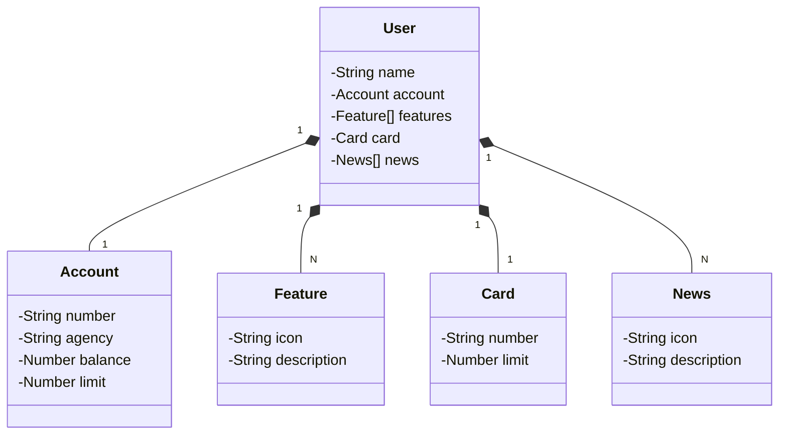
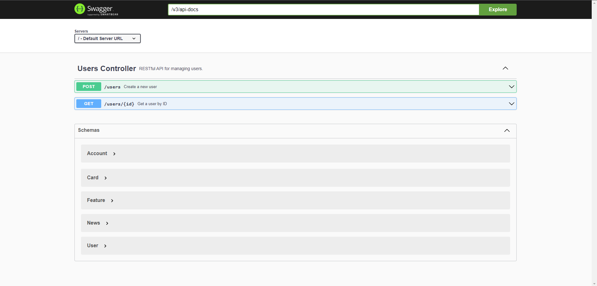

#  Santander Dev Week 2023 Java API
> RESTful API da Santander Dev Week 2023 construída em Java 17 com Spring Boot 3.

## ✔️ Status do Projeto
> 🚧 Em construção...  🚧

## Diagrama de Classes (Domínio da API)

## Routes

## Deploy - Documentação da API

#### [https://sdw23.up.railway.app/swagger-ui/index.html#/](https://sdw23.up.railway.app/swagger-ui/index.html#/)

## 🛠️ Tecnologias Utilizadas

- spring initialzr
- spring-boot-starter-web
- spring-boot-starter-data-jpa
- springdoc-openapi-starter-webmvc-ui
- h2
- postgresql